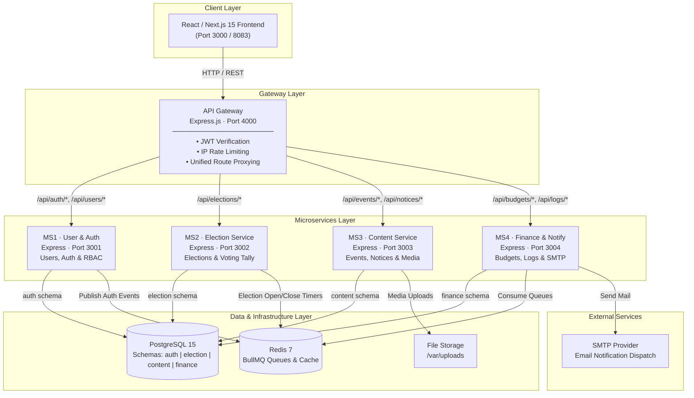

# CSEDU Students' Club Management System

An enterprise-grade, microservices-based web platform powering digital club operations, secure electronic voting, event management, and automated financial workflows for the Department of Computer Science and Engineering, University of Dhaka.

[](https://nextjs.org/)
[](https://nodejs.org/)
[](https://www.postgresql.org/)
[](https://redis.io/)
[](https://www.docker.com/)
[](https://www.typescriptlang.org/)

---

## Table of Contents

- [Executive Summary](#executive-summary)
- [Key Technical Highlights](#key-technical-highlights)
- [Tech Stack](#tech-stack)
- [Architecture and System Design](#architecture-and-system-design)
- [Microservices Breakdown](#microservices-breakdown)
- [Authentication and Authorization Workflow](#authentication-and-authorization-workflow)
- [Quick Start and Deployment](#quick-start-and-deployment)
- [API Gateway Endpoints](#api-gateway-endpoints)
- [Database Architecture](#database-architecture)
- [Repository Structure](#repository-structure)
- [Development Team](#development-team)

---

## Executive Summary

The CSEDU Students' Club Management System is a production-ready, distributed web application engineered by Team Formula1. Designed to serve the University of Dhaka's CSE department, it handles concurrent workloads during electronic voting and major departmental events by utilizing a microservices architecture behind a centralized API Gateway, backed by PostgreSQL multi-schema data isolation, Redis BullMQ asynchronous task queues, and Docker containerization.

---

## Key Technical Highlights

- **Decoupled Microservices Architecture**: Domain logic is separated into 4 independent microservices (`ms1-auth`, `ms2-election`, `ms3-content`, `ms4-finance`), ensuring system fault tolerance and independent service scalability.
- **Secure Centralized API Gateway**: A unified entry point managing JWT authentication verification, IP rate-limiting (`express-rate-limit`), dynamic request routing, CORS rules, and security headers via `Helmet`.
- **Electronic Voting Engine**: End-to-end election management (candidate nominations, voting, real-time vote tallying) with automated opening and closing schedules managed by Redis BullMQ.
- **Event-Driven Background Processing**: Asynchronous email notifications (Nodemailer/SMTP) and audit log processing handled via Redis and BullMQ queues to preserve HTTP response times.
- **Multi-Schema Database Isolation**: PostgreSQL database instance configured with domain-isolated schemas (`auth`, `election`, `content`, `finance`), enforcing strict structural boundaries.
- **Full Docker Orchestration**: Streamlined environment containerization using Docker Compose with automated health checks, dependency ordering, and data persistence.
- **Modern React Frontend**: Type-safe interface developed with Next.js 15 App Router, Tailwind CSS, TanStack React Query (v5), and TypeScript.

---

## Tech Stack

### Frontend
| Technology | Role |
| :--- | :--- |
| **Next.js 15** | React Framework (App Router, Server and Client Components) |
| **TypeScript** | Static Typing and Interface Definitions |
| **Tailwind CSS** | Utility-First Styling |
| **TanStack React Query (v5)** | Server State Management and API Data Caching |
| **Axios** | HTTP Client |
| **React Hook Form and Zod** | Form State Handling and Schema Validation |

### Backend and Microservices
| Technology | Role |
| :--- | :--- |
| **Node.js and Express.js** | Microservices Engine and API Gateway |
| **JWT (JSON Web Tokens)** | Bearer Token Authentication (Access and Refresh Tokens) |
| **BullMQ and Redis 7** | Message Queue and Background Job Processing |
| **Nodemailer** | Asynchronous Mail Dispatch via SMTP |

### Database, Infrastructure and Tooling
| Technology | Role |
| :--- | :--- |
| **PostgreSQL 15** | Relational Database with Multi-Schema Architecture |
| **Redis 7** | In-Memory Cache and Queue Broker |
| **Docker and Docker Compose** | Multi-Container Deployment and Local Orchestration |
| **PowerShell and Bash** | Automation Scripts for Migrations and Database Seeding |

---

## Architecture and System Design



---

## Microservices Breakdown

| Microservice | Internal Port | Database Schema | Primary Responsibilities |
| :--- | :--- | :--- | :--- |
| **`api-gateway`** | `4000` | N/A | Reverse proxy, security headers (`Helmet`), JWT verification, rate limiting. |
| **`ms1-auth`** | `3001` | `auth` | User registration, authentication, RBAC, user status transitions (`PENDING` to `ACTIVE`), token refresh. |
| **`ms2-election`** | `3002` | `election` | Candidate registration, ballot submission, automated scheduling, vote tallying. |
| **`ms3`** | `3003` | `content` | Event management, notice announcements, file and media uploads. |
| **`ms4-finance-notification-log`** | `3004` | `finance` | Budget allocations, expense tracking, background SMTP email queues, system audit logs. |

---

## Authentication and Authorization Workflow

```
+-------------------------------------------------------------+
| 1. USER REGISTERS                                           |
|    POST /api/auth/register  --> Status: PENDING             |
+-------------------------------------------------------------+
                            |
                            v
+-------------------------------------------------------------+
| 2. ADMIN APPROVES USER                                      |
|    PATCH /api/users/:id/status --> Status: ACTIVE            |
+-------------------------------------------------------------+
                            |
                            v
+-------------------------------------------------------------+
| 3. USER LOGS IN                                             |
|    POST /api/auth/login                                     |
|    Receives: Access Token (15 min) & Refresh Token (7 days) |
+-------------------------------------------------------------+
                            |
                            v
+-------------------------------------------------------------+
| 4. GATEWAY INJECTS CONTEXT HEADERS                          |
|    Injects X-User-Id & X-User-Role to downstream services   |
+-------------------------------------------------------------+
```

---

## Quick Start and Deployment

### 1. Prerequisites
- **Docker Engine** v20.10 or higher
- **Docker Compose** v2.0 or higher

### 2. Environment Configuration
```bash
git clone https://github.com/SudinsHub/CSEDUSC-by-Formula1.git
cd CSEDUSC-by-Formula1

# Create environment configuration file
cp .env.example .env
```

### 3. Launch Container Stack
```bash
docker compose up -d --build
```

### 4. Execute Migrations and Seed Initial Admin Account
**Linux / macOS:**
```bash
chmod +x run-migrations.sh create-first-admin.sh
./run-migrations.sh
./create-first-admin.sh
```

**Windows (PowerShell):**
```powershell
.\run-migrations.ps1
.\create-first-admin.ps1
```

---

## Swagger UI API Documentation

Interactive API documentation powered by Swagger UI and OpenAPI 3.0 specification is available live at:

- 🌐 **Hosted Swagger UI**: [https://csedusc-formula1.farefin.com/docs](https://csedusc-formula1.farefin.com/docs)
- 💻 **Local Gateway Swagger UI**: [http://localhost:4000/docs](http://localhost:4000/docs) (or `/api-docs` / `/swagger`)
- 📄 **Raw OpenAPI JSON Spec**: [https://csedusc-formula1.farefin.com/openapi.json](https://csedusc-formula1.farefin.com/openapi.json)

---

## API Gateway Endpoints

Traffic routes through the API Gateway at `http://localhost:4000` (or `https://csedusc-formula1.farefin.com`):

| Endpoint Route | Target Service | Description | Auth Required |
| :--- | :--- | :--- | :--- |
| `GET /docs` | `api-gateway` | Interactive Swagger UI API Documentation | No |
| `GET /openapi.json` | `api-gateway` | OpenAPI 3.0 JSON Specification | No |
| `POST /api/auth/register` | `ms1-auth` | User account registration | No |
| `POST /api/auth/login` | `ms1-auth` | User login and token generation | No |
| `POST /api/auth/refresh` | `ms1-auth` | Refresh access token | No |
| `GET /api/users` | `ms1-auth` | List users (Filter by status) | Yes (Admin) |
| `PATCH /api/users/:id/status` | `ms1-auth` | Approve or modify user status | Yes (Admin) |
| `GET/POST /api/elections` | `ms2-election` | Election management | Yes |
| `POST /api/elections/:id/vote` | `ms2-election` | Cast ballot | Yes (Student) |
| `GET/POST /api/events` | `ms3-content` | Event management and signup | Yes |
| `GET/POST /api/notices` | `ms3-content` | Noticeboard management | Yes |
| `GET/POST /api/budgets` | `ms4-finance` | Financial budget tracking | Yes (Admin/Executive) |
| `GET /api/logs` | `ms4-finance` | System audit logs | Yes (Admin) |

---

## Database Architecture

PostgreSQL is configured with logical schema separation:

- **`auth` Schema**: Manages user credentials, password hashes (`bcrypt`), role-based permissions, and refresh tokens.
- **`election` Schema**: Manages election parameters, candidate nominations, voting eligibility, and vote records.
- **`content` Schema**: Manages event registrations, noticeboard posts, media file metadata, and upload records.
- **`finance` Schema**: Manages budget allocations, expense entries, payment records, and audit logs.

---

## Repository Structure

```
CSEDUSC-by-Formula1/
├── api-gateway/                    # Express.js API Gateway (Proxy, Security, Rate Limit)
├── frontend/                       # Next.js 15 React Frontend (TypeScript, Tailwind, React Query)
├── ms1-auth/                       # User Management and Auth Microservice
├── ms2-election/                   # Election and Secure Voting Microservice
├── ms3/                            # Events, Notices and File Storage Microservice
├── ms4-finance-notification-log/    # Finance, Audit Logging and Async SMTP Microservice
├── docker-compose.yml              # Container Orchestration Specification
├── init-db.sql                     # PostgreSQL Multi-Schema Initializer Script
├── run-migrations.sh / .ps1        # Database Schema Migration Scripts
├── create-first-admin.sh / .ps1    # Initial Admin Account Seeding Script
└── README.md                       # System Technical Documentation
```

---

## Development Team

Developed for the Department of Computer Science and Engineering, University of Dhaka (CSEDU) by Team Formula1:

- **Amio Rashid** — Microservice 1 (User Management and Authentication Service)
- **Syed Naimul Islam** — Microservice 2 (Election and Voting Service)
- **Md. Al Habib** — Microservice 3 (Events, Notices and Media Storage Service)
- **Mahmud Hasan Walid** — Microservice 4 (Finance, Notifications and Audit Logging Service)

---

## License

Distributed under the MIT License. See `LICENSE` for details.
