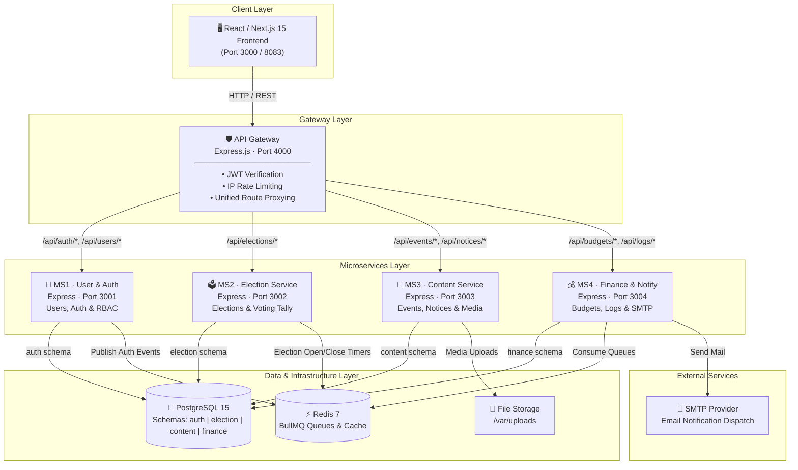

# 🎓 CSEDU Students' Club Management System

> **An enterprise-grade, microservices-based web platform powering digital club operations, secure electronic voting, event management, and automated financial workflows for the CSEDU Students' Club.**

[](https://nextjs.org/)
[](https://nodejs.org/)
[](https://www.postgresql.org/)
[](https://redis.io/)
[](https://www.docker.com/)
[](https://www.typescriptlang.org/)
[](#-architecture--system-design)

---

## 📋 Table of Contents

- [Executive Summary](#-executive-summary)
- [Key Engineering Highlights](#-key-engineering-highlights)
- [Tech Stack](#-tech-stack)
- [Architecture & System Design](#-architecture--system-design)
- [Microservices Overview](#-microservices-overview)
- [Authentication & Authorization Workflow](#-authentication--authorization-workflow)
- [Quick Start & Docker Deployment](#-quick-start-docker-deployment)
- [API Gateway Endpoints](#-api-gateway-endpoints-overview)
- [Database Architecture](#-database-architecture)
- [Repository Structure](#-repository-structure)
- [Engineering Team](#-engineering-team--formula1)

---

## 📌 Executive Summary

The **CSEDU Students' Club Management System** is a production-ready, distributed web application engineered by **Team Formula1**. Designed to serve the University of Dhaka's CSE department, it handles high-concurrency workloads during electronic voting and major events by shifting away from monolithic constraints to a **microservices architecture** behind a centralized **API Gateway**, backed by PostgreSQL multi-schema data isolation, Redis BullMQ asynchronous task queues, and full Docker containerization.

---

## 🌟 Key Engineering Highlights

- **🏗️ Decoupled Microservices Architecture**: Domain logic split into 4 independent microservices (`ms1-auth`, `ms2-election`, `ms3-content`, `ms4-finance`), ensuring high availability and independent scalability.
- **🛡️ Secure Centralized API Gateway**: Single entry point handling JWT verification, IP rate-limiting (`express-rate-limit`), dynamic request routing, CORS policies, and security headers via `Helmet`.
- **🗳️ Tamper-Resistant Election Engine**: Full election lifecycle support (candidate nominations, voting, real-time tallying) with automated open/close timing scheduled via Redis BullMQ queues.
- **⚡ Event-Driven Background Processing**: Asynchronous email notifications (Nodemailer/SMTP) and audit log ingestion processed via **Redis & BullMQ** to keep HTTP latency minimal.
- **🗄️ Multi-Schema Database Isolation**: Single PostgreSQL instance configured with isolated schemas (`auth`, `election`, `content`, `finance`), enforcing strong domain boundaries at the database level.
- **🐳 Full Docker Orchestration**: One-command deployment via Docker Compose with health checks, container dependency ordering, and persistent data volumes.
- **🎨 Modern Next.js 15 Frontend**: Type-safe frontend built with Next.js App Router, Tailwind CSS, TanStack React Query (v5), and Lucide Icons.

---

## 🛠️ Tech Stack

### **Frontend**
| Technology | Role |
| :--- | :--- |
| **Next.js 15** | React Framework (App Router, Server/Client Components) |
| **TypeScript** | Static Typing & Interface Definitions |
| **Tailwind CSS** | Utility-First Styling |
| **TanStack React Query (v5)** | Server State Management & API Caching |
| **Axios** | HTTP Client |
| **React Hook Form & Zod** | Form Validation & Schema Enforcement |

### **Backend & Microservices**
| Technology | Role |
| :--- | :--- |
| **Node.js & Express.js** | Microservices Engine & API Gateway |
| **JWT (JSON Web Tokens)** | Bearer Auth (Short-lived Access Tokens + Refresh Tokens) |
| **BullMQ & Redis 7** | Message Queue & Background Job Processing |
| **Nodemailer** | SMTP Async Mail Dispatch |

### **Database, Infrastructure & Tools**
| Technology | Role |
| :--- | :--- |
| **PostgreSQL 15** | Multi-schema Relational Database |
| **Redis 7** | In-memory Cache & Queue Broker |
| **Docker & Docker Compose** | Multi-container Deployment & Local Orchestration |
| **PowerShell & Bash** | Database Migration & Admin Seeding Automation |

---

## 🏗️ Architecture & System Design



---

## 🧩 Microservices Overview

| Microservice | Internal Port | Database Schema | Primary Responsibilities |
| :--- | :--- | :--- | :--- |
| **`api-gateway`** | `4000` | N/A | Reverse proxy, security headers (`Helmet`), JWT verification, rate limiting. |
| **`ms1-auth`** | `3001` | `auth` | User registration, authentication, RBAC, user status (`PENDING` ➔ `ACTIVE`), token refresh. |
| **`ms2-election`** | `3002` | `election` | Candidate registration, ballot casting, automated scheduled opening/closing, live tallying. |
| **`ms3`** | `3003` | `content` | Event registration, noticeboard announcements, file & media upload validation. |
| **`ms4-finance-notification-log`** | `3004` | `finance` | Budget tracking, transaction approvals, background SMTP email queues, audit logs. |

---

## 🔑 Authentication & Authorization Workflow

```
┌─────────────────────────────────────────────────────────────┐
│ 1. USER REGISTERS                                           │
│    POST /api/auth/register  --> Status: PENDING             │
└─────────────────────────────────────────────────────────────┘
                            │
                            ▼
┌─────────────────────────────────────────────────────────────┐
│ 2. ADMIN APPROVES USER                                      │
│    PATCH /api/users/:id/status --> Status: ACTIVE            │
└─────────────────────────────────────────────────────────────┘
                            │
                            ▼
┌─────────────────────────────────────────────────────────────┐
│ 3. USER LOGS IN                                             │
│    POST /api/auth/login                                     │
│    Receives: Access Token (15 min) & Refresh Token (7 days) │
└─────────────────────────────────────────────────────────────┘
                            │
                            ▼
┌─────────────────────────────────────────────────────────────┐
│ 4. GATEWAY INJECTS CONTEXT HEADERS                          │
│    Injects X-User-Id & X-User-Role to downstream services   │
└─────────────────────────────────────────────────────────────┘
```

---

## 🚀 Quick Start (Docker Deployment)

### 1. Prerequisites
- **Docker Engine** v20.10+
- **Docker Compose** v2.0+

### 2. Environment Configuration
```bash
git clone https://github.com/your-org/CSEDUSC-by-Formula1.git
cd CSEDUSC-by-Formula1

# Create standard environment file
cp .env.example .env  # Or populate .env with database and JWT secrets
```

### 3. Launch the Stack
```bash
docker compose up -d --build
```
*Spins up PostgreSQL, Redis, API Gateway, 4 Microservices, and the Next.js Frontend.*

### 4. Apply Database Migrations & Create First Admin
**Linux / macOS:**
```bash
chmod +x run-migrations.sh create-first-admin.sh
./run-migrations.sh
./create-first-admin.sh
```

**Windows (PowerShell):**
```powershell
.\run-migrations.ps1
.\create-first-admin.ps1
```

---

## 🌐 API Gateway Endpoints Overview

All frontend and client traffic routes through the API Gateway at `http://localhost:4000`:

| Endpoint Route | Target Service | Description | Auth Required |
| :--- | :--- | :--- | :---: |
| `POST /api/auth/register` | `ms1-auth` | Account registration | ❌ |
| `POST /api/auth/login` | `ms1-auth` | User login & token generation | ❌ |
| `POST /api/auth/refresh` | `ms1-auth` | Refresh access token | ❌ |
| `GET /api/users` | `ms1-auth` | List users (Filter by status) | 🔒 Admin |
| `PATCH /api/users/:id/status` | `ms1-auth` | Approve/Suspend user status | 🔒 Admin |
| `GET/POST /api/elections` | `ms2-election` | Election management | 🔒 |
| `POST /api/elections/:id/vote` | `ms2-election` | Cast ballot | 🔒 Student |
| `GET/POST /api/events` | `ms3-content` | Event publishing & signup | 🔒 |
| `GET/POST /api/notices` | `ms3-content` | Noticeboard management | 🔒 |
| `GET/POST /api/budgets` | `ms4-finance` | Financial budget tracking | 🔒 Admin/Exec |
| `GET /api/logs` | `ms4-finance` | System audit logs | 🔒 Admin |

---

## 📊 Database Architecture

PostgreSQL is structured with **logical schema separation** for maximum domain clean-up:

- **`auth` Schema**: Stores user profiles, password hashes (`bcrypt`), roles, permissions, and active refresh token hashes.
- **`election` Schema**: Stores election metadata, candidate nominations, voter eligibility, encrypted/tallied votes.
- **`content` Schema**: Stores event registrations, notice entries, attachment metadata, and upload logs.
- **`finance` Schema**: Stores financial line items, budget requests, expense receipts, and system audit trail logs.

---

## 📁 Repository Structure

```
CSEDUSC-by-Formula1/
├── api-gateway/                    # Express.js API Gateway (Proxy, Security, Rate Limit)
├── frontend/                       # Next.js 15 React Frontend (TypeScript, Tailwind, React Query)
├── ms1-auth/                       # User Management & Auth Microservice
├── ms2-election/                   # Election & Secure Voting Microservice
├── ms3/                            # Events, Notices & File Storage Microservice
├── ms4-finance-notification-log/    # Finance, Audit Logging & Async SMTP Microservice
├── docker-compose.yml              # Container Orchestration Specification
├── init-db.sql                     # PostgreSQL Multi-schema Initializer Script
├── run-migrations.sh / .ps1        # Database Schema Migration Automation
├── create-first-admin.sh / .ps1    # Superadmin Seeding Utility
└── README.md                       # Repository Documentation
```

---

## 👥 Engineering Team — Formula1

Built for the **Department of Computer Science and Engineering, University of Dhaka (CSEDU)**.

- **Amio Rashid** — Microservice 1 (User Management & Authentication Service)
- **Syed Naimul Islam** — Microservice 2 (Election & Secure Voting Service)
- **Md. Al Habib** — Microservice 3 (Events, Notices & Media Storage Service)
- **Mahmud Hasan Walid** — Microservice 4 (Finance, Notifications & Audit Logging Service)

---

## 📜 License

Distributed under the MIT License. See `LICENSE` for more details.
