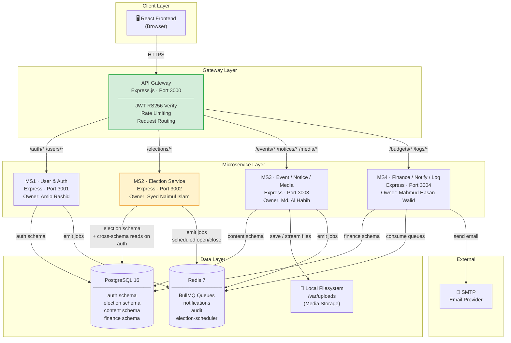
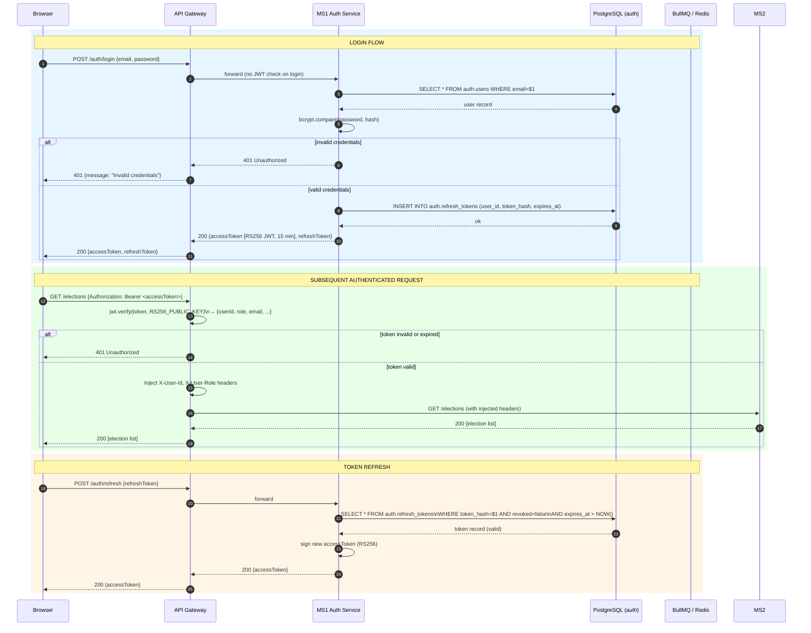
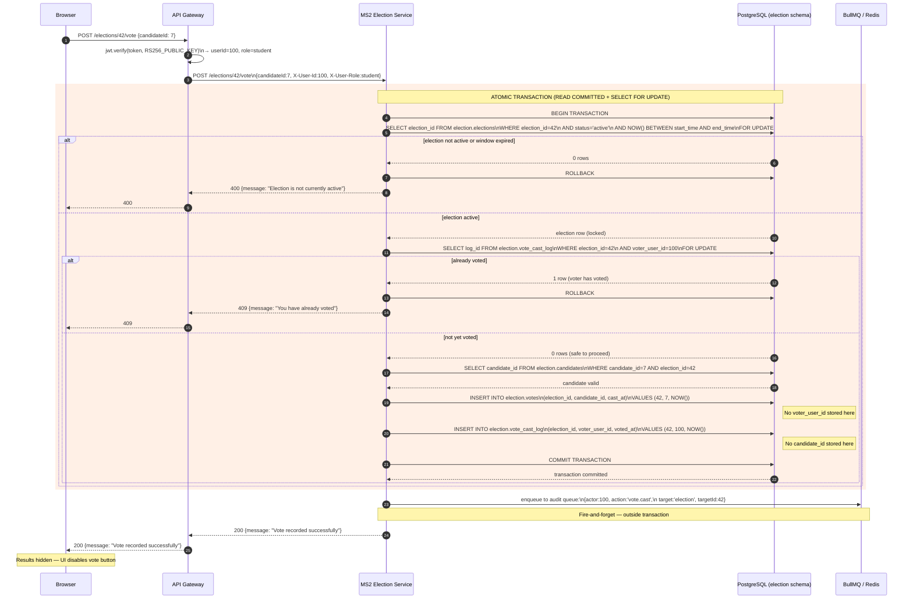
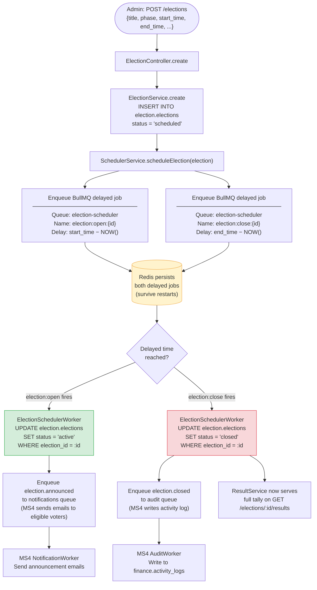
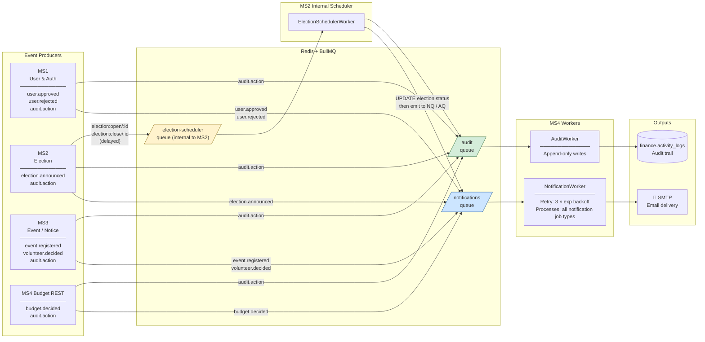
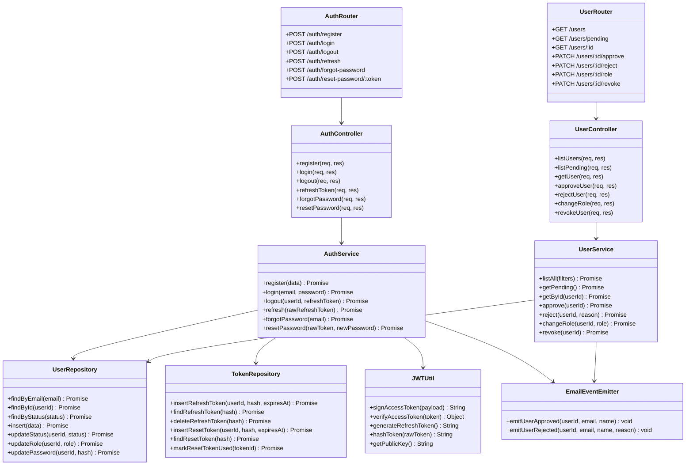
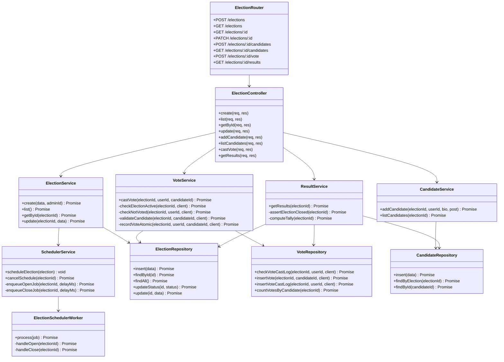
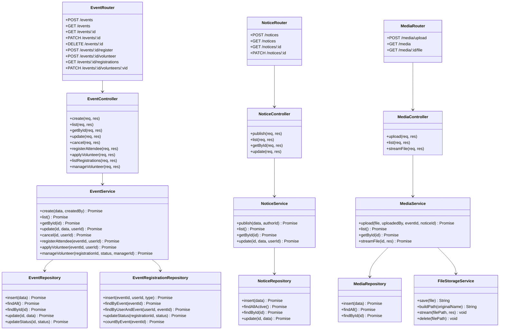
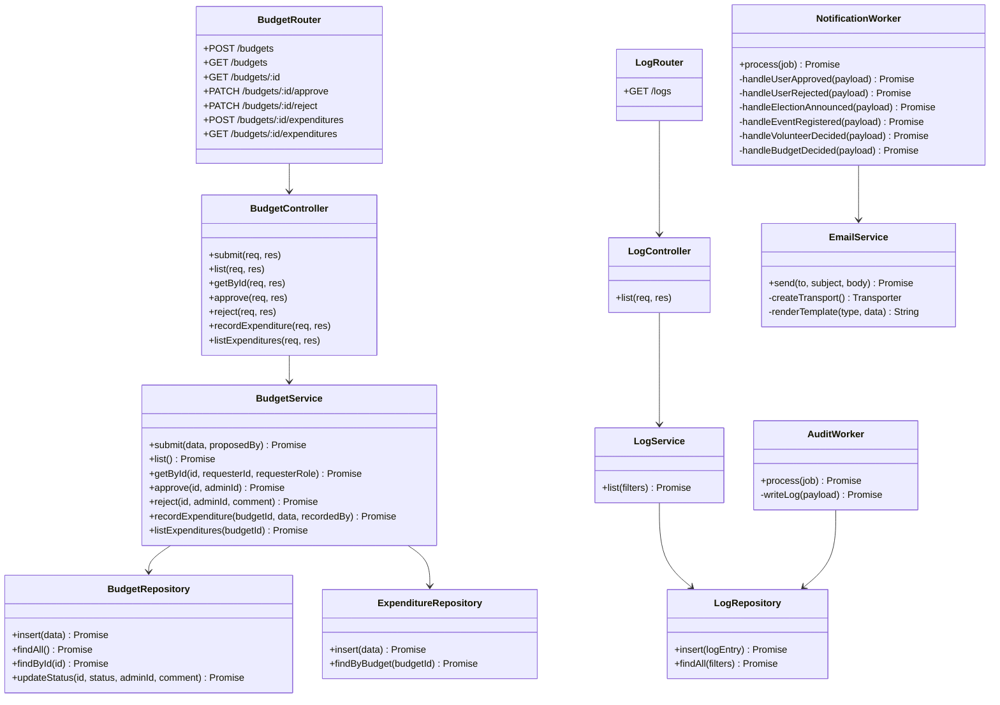

# CSEDU Club Management System — SDD Mermaid Diagrams
**Formula1 · SDD 01 v1.0**
Render each block at [https://mermaid.live](https://mermaid.live) and export as PNG.
Suggested export width: **1800 px** for full-page figures; **1200 px** for half-page.

---

## Diagram 1 — System Architecture
*Save as: `diag_architecture.png`*

---

## Diagram 2 — Auth Flow Sequence
*Save as: `diag_auth_flow.png`*

---

## Diagram 3 — Vote Critical Path Sequence
*Save as: `diag_vote_sequence.png`*

---

## Diagram 4 — Election Scheduler Flowchart
*Save as: `diag_scheduler_flow.png`*

---

## Diagram 5 — BullMQ Event Flow
*Save as: `diag_bullmq_flow.png`*

---

## Diagram 6 — MS1 Module Diagram
*Save as: `diag_ms1_modules.png`*

---

## Diagram 7 — MS2 Module Diagram
*Save as: `diag_ms2_modules.png`*

---

## Diagram 8 — MS3 Module Diagram
*Save as: `diag_ms3_modules.png`*

---

## Diagram 9 — MS4 Module Diagram
*Save as: `diag_ms4_modules.png`*

---

## Diagram 10 — Consolidated ER Diagram
*Save as: `diag_er.png`*

```mermaid
erDiagram

    %% ── auth schema ───────────────────────────────────────────
    AUTH_USERS {
        int     user_id         PK
        varchar name
        varchar email
        text    password_hash
        varchar role
        varchar status
        int     batch_year
        ts      created_at
        ts      updated_at
    }
    AUTH_REFRESH_TOKENS {
        int     token_id    PK
        int     user_id     FK
        text    token_hash
        ts      expires_at
        bool    revoked
        ts      created_at
    }
    AUTH_RESET_TOKENS {
        int     token_id    PK
        int     user_id     FK
        text    token_hash
        ts      expires_at
        bool    used
        ts      created_at
    }

    %% ── election schema ───────────────────────────────────────
    ELECTION_ELECTIONS {
        int     election_id         PK
        varchar title
        int     phase
        varchar status
        text    rules
        int     max_votes_per_user
        ts      start_time
        ts      end_time
        int     created_by
        ts      created_at
    }
    ELECTION_CANDIDATES {
        int     candidate_id    PK
        int     election_id     FK
        int     user_id
        text    bio
        varchar post
        ts      created_at
    }
    ELECTION_VOTES {
        int     vote_id         PK
        int     election_id     FK
        int     candidate_id    FK
        ts      cast_at
    }
    ELECTION_VOTE_CAST_LOG {
        int     log_id          PK
        int     election_id     FK
        int     voter_user_id
        ts      voted_at
    }

    %% ── content schema ────────────────────────────────────────
    CONTENT_EVENTS {
        int     event_id            PK
        varchar title
        text    description
        ts      event_date
        varchar location
        int     volunteers_needed
        varchar status
        int     created_by
        ts      created_at
    }
    CONTENT_EVENT_REGISTRATIONS {
        int     registration_id PK
        int     event_id        FK
        int     user_id
        varchar type
        varchar status
        ts      registered_at
    }
    CONTENT_NOTICES {
        int     notice_id   PK
        varchar title
        text    content
        varchar priority
        date    expiry_date
        int     created_by
        ts      published_at
    }
    CONTENT_MEDIA {
        int     media_id    PK
        text    file_path
        varchar file_type
        int     event_id
        int     notice_id
        int     uploaded_by
        ts      uploaded_at
    }

    %% ── finance schema ────────────────────────────────────────
    FINANCE_BUDGETS {
        int     budget_id       PK
        int     event_id
        int     proposed_by
        varchar status
        dec     total_amount
        jsonb   line_items
        text    admin_comment
        int     reviewed_by
        ts      submitted_at
        ts      reviewed_at
    }
    FINANCE_EXPENDITURES {
        int     expenditure_id  PK
        int     budget_id       FK
        varchar category
        dec     amount
        text    description
        ts      recorded_at
        int     recorded_by
    }
    FINANCE_ACTIVITY_LOGS {
        int     log_id              PK
        int     actor_user_id
        varchar action_type
        varchar target_entity
        int     target_entity_id
        jsonb   details
        ts      logged_at
    }

    %% ── relationships ─────────────────────────────────────────
    AUTH_USERS            ||--o{ AUTH_REFRESH_TOKENS       : "has"
    AUTH_USERS            ||--o{ AUTH_RESET_TOKENS         : "requests"

    ELECTION_ELECTIONS    ||--o{ ELECTION_CANDIDATES       : "has"
    ELECTION_ELECTIONS    ||--o{ ELECTION_VOTES            : "contains"
    ELECTION_ELECTIONS    ||--o{ ELECTION_VOTE_CAST_LOG    : "tracks"
    ELECTION_CANDIDATES   ||--o{ ELECTION_VOTES            : "receives"

    CONTENT_EVENTS        ||--o{ CONTENT_EVENT_REGISTRATIONS : "has"
    CONTENT_EVENTS        ||--o{ CONTENT_MEDIA               : "has"
    CONTENT_NOTICES       ||--o{ CONTENT_MEDIA               : "has"

    FINANCE_BUDGETS       ||--o{ FINANCE_EXPENDITURES      : "tracks"
```

---

## Rendering Tips

| Diagram | Recommended width | Notes |
|---|---|---|
| System Architecture | 1800 px | Use `flowchart TB` layout |
| Auth Flow Sequence | 1400 px | Sequence diagram — tall |
| Vote Critical Path | 1600 px | Sequence diagram — tall |
| Scheduler Flowchart | 1000 px | Narrow vertical flow |
| BullMQ Event Flow | 1600 px | Wide horizontal |
| MS1–MS4 Module Diagrams | 1600 px each | classDiagram — wide |
| ER Diagram | 2000 px | Large — use full width in LaTeX |

After exporting, reference images in `sdd_main.tex` by placing PNG files in the same
directory and using `\includegraphics{diag_architecture.png}` etc.
